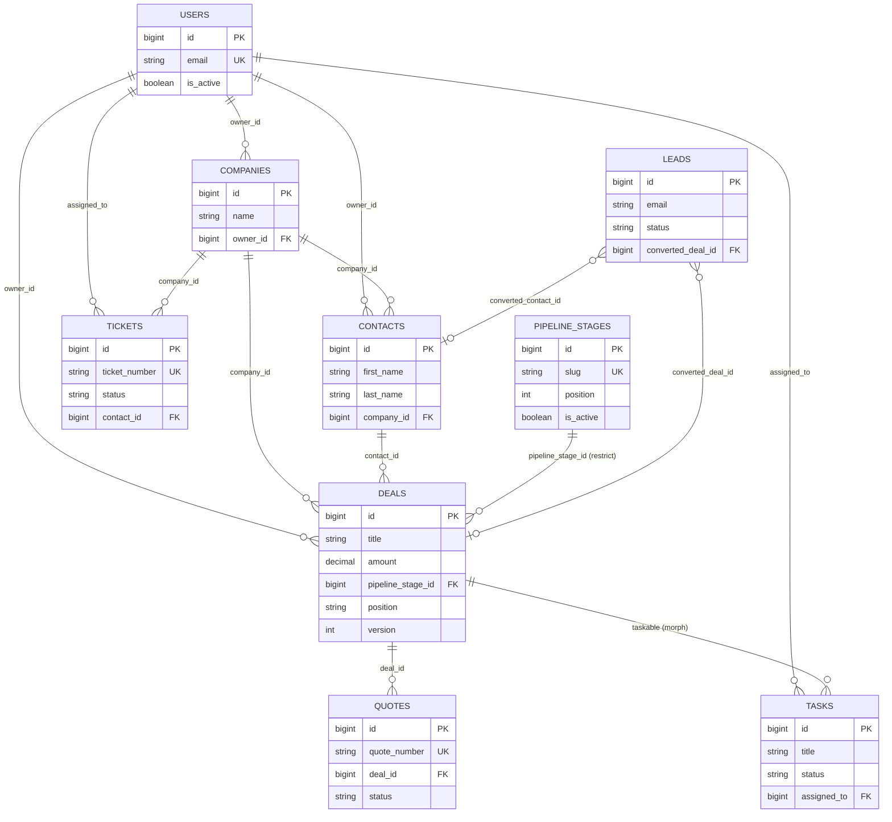

**English** | [Türkçe](README.tr.md)

# Syncra

Syncra is a closed-circuit (invite-only) enterprise CRM system. It is developed as a monorepo built on Laravel 12 + React 18.

## Project Structure

| Directory | Description |
| --- | --- |
| `backend/` | Laravel 12-based REST API (authentication via Sanctum, real-time events via Reverb). |
| `frontend/` | Single-page application (SPA) built with React 18 + Vite. |
| `docs/` | Roadmap, progress log, and design system documentation. |

Related documents:
- [docs/ROADMAP.md](docs/ROADMAP.md)
- [docs/PROGRESS.md](docs/PROGRESS.md)

## Technology Stack

| Layer | Technology | Version / Note |
| --- | --- | --- |
| Backend | Laravel | 12.67.0 |
| Backend | Laravel Sanctum | Authentication (SPA cookie-based) |
| Backend | spatie/laravel-permission | Role and permission management |
| Backend | PHP | 8.2.12 |
| Frontend | React | 18.3.1 |
| Frontend | Vite | Build/dev server |
| Frontend | React Router | Client-side routing |
| Frontend | TanStack Query | Server state management / data fetching |
| Frontend | Zustand | Client state management |
| Frontend | Tailwind CSS | 4.3.3 |
| Database | MySQL / MariaDB | 10.4.32 (MariaDB), database name: `syncra_crm` |
| Realtime | Laravel Reverb + Laravel Echo | WebSocket server and client library |
| Queue / Cache | Redis | 8.0.5 (on WSL2) |
| Tooling | Node.js | 26.7.0 |
| Logging | spatie/laravel-activitylog ^4.12 + maatwebsite/excel ^3.1 | audit trail, CSV/XLSX export |
| Drag-and-drop | @dnd-kit/core ^6.3 + sortable ^10 | Kanban board, with keyboard accessibility |
| PDF | barryvdh/laravel-dompdf ^3.1 | quote output, DejaVu Sans (Turkish + ₺), font subsetting enabled |

> **Note:** The project originally targeted Laravel 11. Because Laravel 11.x has unpatched security vulnerabilities (including CVE-2026-48019) with no fix on the 11.x line, the project migrated to Laravel 12. See details in the `docs/PROGRESS.md` decision log.

## Prerequisites

This project has been verified in the following environment:

| Component | Version / Location | Note |
| --- | --- | --- |
| PHP | 8.2.12 — `C:\xampp\php\php.exe` | `zip` and `intl` extensions must be enabled |
| Composer | 2.10.2 — `C:\xampp\php\composer.bat` | |
| MariaDB | 10.4.32 — `127.0.0.1:3306` | User `root`, empty password, utf8mb4. **Not installed as a Windows service** — must be started from the XAMPP Control Panel |
| Redis | 8.0.5 — on WSL2 Ubuntu, `127.0.0.1:6379` | Memurai is not installed |
| Node.js | v26.7.0 | |
| npm | 11.19.0 | |

Additional notes:
- The `redis` C extension is not installed for PHP; the backend therefore uses the `predis/predis` package (`REDIS_CLIENT=predis`).
- `C:\xampp\php` has been added to the user PATH. This change only takes effect in **newly opened terminals**; in existing terminals use the full path (`C:\xampp\php\php.exe`) instead of the `php` command.

### Setup Steps (Prerequisites)

**XAMPP:** PHP 8.2 or higher is required — a lower version cannot run Laravel 12. After installing XAMPP, uncomment (remove the leading `;` from) the following lines in `php.ini`:
```ini
extension=zip
extension=intl
```

**Composer:** The `composer.bat` bundled with XAMPP can be used, or it can be installed separately via [getcomposer.org](https://getcomposer.org/).

**Redis (two options on Windows):**
- **(a) WSL2 + Ubuntu (the method used in this project):**
  ```
  wsl --install
  sudo apt install redis-server
  sudo service redis-server start
  ```
  Accessible from Windows via `127.0.0.1:6379`.
- **(b) Memurai:** A Windows-native Redis service, an alternative for those who don't want WSL2.

## Installation

1. Clone the repository.
2. Start MySQL: XAMPP Control Panel → **MySQL** → **Start**. If you'll use phpMyAdmin, also start **Apache**.
3. Create the database (the database name must be **`syncra_crm`**):
   - via phpMyAdmin, or
   - from the command line:
     ```
     mysql -u root -e "CREATE DATABASE syncra_crm CHARACTER SET utf8mb4 COLLATE utf8mb4_unicode_ci;"
     ```
4. Start Redis (from within WSL): `sudo service redis-server start`. To verify: `redis-cli ping` should return `PONG`.
5. Backend setup:
   ```
   cd backend
   composer install
   cp .env.example .env
   php artisan key:generate
   php artisan migrate --seed
   ```
   This command creates the roles, permissions, and the Super Admin account.
6. Frontend setup:
   ```
   cd frontend
   npm install
   cp .env.example .env
   ```
   Note: Since Tailwind v4 is used, there is no `tailwind.config.js`; the theme is defined via `@theme` in `frontend/src/styles/tokens.css`.

## Running the Application

For the application to run fully, four processes must be run in four separate terminals:

| Process | Command | Port |
| --- | --- | --- |
| API | `cd backend && php artisan serve` | 8000 |
| WebSocket (Reverb) | `cd backend && php artisan reverb:start` (ws://localhost:8080) | 8080 |
| Queue worker | `cd backend && php artisan queue:work` | — |
| Frontend | `cd frontend && npm run dev` | 5173 |

Alternatively, running the **`dev.bat`** file in the root directory starts all four processes at once, each in its own window.

`php artisan schedule:work` is required for scheduled tasks — 3 commands run: `logs:prune` prunes old log records every day at 03:17 (page_visit_logs after 90 days, session_logs and activity_log after 365 days), `tasks:dispatch-reminders` sends task reminders once a minute, `tickets:scan-sla` scans for tickets approaching or exceeding SLA every 5 minutes. Reminders and SLA scanning do not run unless `schedule:work` is running.

## Troubleshooting

- **`php` command not found:** The PATH change only takes effect in newly opened terminals — open a new terminal or use the full path `C:\xampp\php\php.exe`.
- **MySQL connection error:** Make sure the MySQL service is running in the XAMPP Control Panel and that the `syncra_crm` database has been created.
- **Redis connection error:** Run `sudo service redis-server start` inside WSL. `REDIS_CLIENT=predis` must be set in `backend/.env` (the phpredis C extension is not installed).
- **Cannot connect to Reverb:** Make sure the `php artisan reverb:start` process is running, that the `REVERB_*` / `VITE_REVERB_*` values in `backend/.env` and `frontend/.env` match each other, and that port 8080 is free.
- **CORS / 419 error:** Make sure `SANCTUM_STATEFUL_DOMAINS` and `FRONTEND_URL` in `backend/.env` are correct and that `withCredentials: true` is used in frontend requests.
- **`composer install` stops with a security warning** → Composer 2.10+ blocks installation of versions with known vulnerabilities. This is the correct behavior; instead of disabling the block, upgrade the package to a safe version (check with `composer audit`).
- **I logged in but every page returns 403 PASSWORD_CHANGE_REQUIRED** → Your account was created with a temporary password; change your password from the /change-password screen. This is deliberate security behavior, see docs/AUTH-FLOWS.md
- **WebSocket doesn't connect / private channel subscription is rejected** → Check (1) whether `php artisan reverb:start` is running, (2) whether there is exactly one `REVERB_APP_ID` in `backend/.env` (`reverb:install` can add a second block), (3) whether the keys in `backend/.env` and `frontend/.env` match, (4) whether the `broadcasting/auth` route is defined in `config/cors.php`.
- **A folder I added doesn't show up in git** → Bare directory rules in `.gitignore` (`logs`, `dist`) match at every depth. Use `git check-ignore -v <file>` to find which rule is blocking it.
- **Turkish characters are garbled in CSV export** → The file is produced with a UTF-8 BOM; open the file directly in Excel instead of using "Data → From Text".
- **Turkish characters are garbled in CSV import** → Download the template from `/api/leads/import/template`; it is produced with a UTF-8 BOM. Save your own file as UTF-8.
- **Duplicate warning doesn't appear** → The check runs once at least one field (email, phone, first name, or last name) is filled in and after a 500ms typing pause. If no field is filled in, no request is sent (the server returns 422).
- **I get a "someone else moved it" warning when moving a card on the Kanban board** → This is a deliberate safeguard. It means the version of the card you see is stale (someone else moved it before you). The card automatically snaps back to its actual position; you can move it again.
- **Why does it ask when I drag a card to the lost stage** → `lost_reason` is required; a move without a loss reason is rejected by the server (422). The win reason is optional.
- **Task reminders don't arrive** → `php artisan schedule:work` must be running (the once-a-minute `tasks:dispatch-reminders` command). Also, reminders are in-app: Reverb (`reverb:start`) and the queue worker (`queue:work`) must also be running.
- **The SLA counter looks wrong** → The counter counts down the remaining time received from the server using `performance.now()`, independent of your computer's clock. If it looks wrong, refresh the page; the remaining time is resynced with the server every 60 seconds.
- **Turkish characters look garbled in the PDF** → The template must use `font-family: 'DejaVu Sans'`. `config/dompdf.php` → `default_font` must also be set to this. The core PDF fonts (Helvetica/Times) do not include Turkish glyphs.
- **I can't change a line item on a sent quote** → This is deliberate: after `sent`, fields affecting the total amount are locked (422 QUOTE_LOCKED). The title, notes, terms, and validity date can be edited; use "Create Revision" to change the amount.
- **The quote total is lower than I expected** → VAT is calculated on the tax base that results AFTER the overall quote discount is subtracted (Turkish VAT Law art. 25/a). See details in docs/QUOTE-FINANCIALS.md

## API Endpoint List

_Endpoints for Phases 2, 4, 5, 6, 7, 8, and 9 have been added; the rest will be completed in Phase 13._

| Method | Path | Permission / Guard | Description |
| --- | --- | --- | --- |
| GET | `/sanctum/csrf-cookie` | — (public) | Retrieves the CSRF cookie, called before login |
| POST | `/api/login` | — (public, rate limited) | Signs in with email + password |
| POST | `/api/password/forgot` | — (public, closed-circuit) | Admin-approved password reset request; always returns 202 |
| POST | `/api/logout` | Authentication required | Signs out |
| GET | `/api/me` | Authentication required | Returns the signed-in user's information |
| POST | `/api/password/change` | Authentication required | Changes the password (whitelisted for `must_change_password`) |
| GET | `/api/users` | `users.manage` | Lists users, paginated/sorted/filtered |
| POST | `/api/users` | `users.manage` | Creates a new user |
| GET | `/api/users/{id}` | `users.manage` | Returns user details |
| PATCH | `/api/users/{id}` | `users.manage` | Updates the user |
| DELETE | `/api/users/{id}` | `users.manage` | Soft-deletes the user |
| PATCH | `/api/users/{id}/active` | `users.manage` | Activates/deactivates the user (instant session revoke) |
| POST | `/api/users/{id}/reset-password` | `users.manage` | Resets the user's password |
| GET | `/api/roles` | `users.manage` | Returns the list of roles |
| POST | `/broadcasting/auth` | Authentication required (`auth:sanctum` + `EnsureUserIsActive`) | Authorizes private/presence channel subscriptions |
| GET | `/api/presence/online` | Authentication required (`auth:sanctum` + `EnsureUserIsActive` + `EnsurePasswordIsChanged`) | Returns the users who are currently online (sourced from the Reverb API) |
| GET | `/api/logs/sessions` | `logs.view` | Lists session logs (login/logout/failed_login/locked_out), paginated/sorted/filtered |
| GET | `/api/logs/page-visits` | `logs.view` | Lists page visit logs, paginated/sorted/filtered |
| GET | `/api/logs/activities` | `logs.view` | Lists audit trail (activity log) records, paginated/sorted/filtered |
| GET | `/api/logs/export` | `logs.export` | Exports log records as CSV or XLSX (`?format=csv|xlsx`, capped at 50,000 rows) |
| POST | `/api/page-visits` | Authentication required | Opens a new page visit record (automatically closes any previously open visit) |
| PATCH | `/api/page-visits/{id}/heartbeat` | Authentication required (own visit only — IDOR protected) | Updates the accumulated duration of an open visit (every 30s) |
| GET | `/api/leads` | `leads.view` | Lists leads, paginated/sorted/filtered/searchable |
| POST | `/api/leads` | `leads.create` | Creates a new lead |
| GET | `/api/leads/{id}` | `leads.view` | Returns lead details |
| PATCH | `/api/leads/{id}` | `leads.update` | Updates the lead (403 for a converted lead) |
| DELETE | `/api/leads/{id}` | `leads.delete` | Soft-deletes the lead (403 for a converted lead) |
| POST | `/api/leads/check-duplicates` | `leads.view` | Checks for duplicate candidates by email/phone/name |
| POST | `/api/leads/{id}/convert` | `leads.convert` | Converts the lead into a contact + (if applicable) a company + (optionally) a deal |
| PATCH | `/api/leads/{id}/assign` | `leads.update` | Assigns the lead to a user |
| POST | `/api/leads/import` | `leads.import` | Starts a bulk CSV import (synchronous under 500 rows, queued above — 202 + `batch_id`) |
| GET | `/api/leads/import/template` | `leads.import` | Downloads a blank CSV template for import (UTF-8 BOM) |
| GET | `/api/leads/import/{batch}` | `leads.import` (only the user who started the batch) | Returns the status/result report of a queued import |
| GET | `/api/contacts` | `contacts.view` | Lists contacts, paginated/sorted/filtered/searchable |
| POST | `/api/contacts` | `contacts.create` | Creates a new contact |
| GET | `/api/contacts/{id}` | `contacts.view` | Returns contact details |
| PATCH | `/api/contacts/{id}` | `contacts.update` | Updates the contact |
| DELETE | `/api/contacts/{id}` | `contacts.delete` | Soft-deletes the contact (422 if it has an open deal) |
| GET | `/api/contacts/{id}/timeline` | `contacts.view` | Returns the contact's unified communication history timeline |
| GET | `/api/companies` | `companies.view` | Lists companies, paginated/sorted/filtered/searchable |
| POST | `/api/companies` | `companies.create` | Creates a new company |
| GET | `/api/companies/{id}` | `companies.view` | Returns company details |
| PATCH | `/api/companies/{id}` | `companies.update` | Updates the company |
| DELETE | `/api/companies/{id}` | `companies.delete` | Soft-deletes the company (422 if it has an open deal) |
| GET | `/api/companies/{id}/timeline` | `companies.view` | Returns the company's unified timeline (including linked contacts) |
| GET | `/api/tags` | Authentication required | Returns the list of tags |
| POST | `/api/tags` | Authentication required | Creates a new tag |
| GET | `/api/custom-fields` | Authentication required | Returns the defined custom fields |
| GET | `/api/deals` | `deals.view` | Lists deals, paginated/sorted/filtered/searchable (`meta.totals`: count/total_amount/open_amount/won_amount/lost_amount) |
| GET | `/api/deals/board` | `deals.view` | Returns cards per stage for the Kanban board (`?per_stage=`, `has_more`, `meta.total_amount`) |
| POST | `/api/deals` | `deals.create` | Creates a new deal (`position`/`version`/`status` are generated server-side) |
| GET | `/api/deals/{id}` | `deals.view` | Returns deal details |
| PATCH | `/api/deals/{id}` | `deals.update` | Updates the deal (`pipeline_stage_id`/`position`/`version`/`status` are rejected — 422) |
| DELETE | `/api/deals/{id}` | `deals.delete` | Soft-deletes the deal (403 for a won/lost deal) |
| PATCH | `/api/deals/{id}/move` | `deals.move` | Moves the deal to another stage/position on the Kanban board; takes neighbor ids + `version`. **Can return 409 DEAL_VERSION_CONFLICT** |
| PATCH | `/api/deals/{id}/assign` | `deals.update` | Assigns the deal to a user |
| GET | `/api/pipeline-stages` | `deals.view` | Returns active pipeline stages in order |
| GET | `/api/tasks` | `tasks.view` | Lists tasks, paginated/sorted/filtered/searchable |
| GET | `/api/tasks/calendar` | `tasks.view` | Returns tasks for the calendar view (`?from`&`?to` required, max 90 days) |
| POST | `/api/tasks` | `tasks.create` | Creates a new task |
| GET | `/api/tasks/{id}` | `tasks.view` | Returns task details |
| PATCH | `/api/tasks/{id}` | `tasks.update` | Updates the task |
| DELETE | `/api/tasks/{id}` | `tasks.delete` | Soft-deletes the task |
| PATCH | `/api/tasks/{id}/complete` | `tasks.update` | Marks the task as complete (idempotent) |
| PATCH | `/api/tasks/{id}/assign` | `tasks.assign` | Assigns the task to a user |
| GET | `/api/tickets` | `tickets.view` | Lists support tickets, paginated/sorted/filtered/searchable (supports `filter[sla_breached]=1`) |
| GET | `/api/tickets/stats` | `tickets.view` | Returns an overall summary independent of filtering and pagination |
| POST | `/api/tickets` | `tickets.create` | Creates a new support ticket |
| GET | `/api/tickets/{id}` | `tickets.view` | Returns ticket details |
| PATCH | `/api/tickets/{id}` | `tickets.update` | Updates the ticket (`status` and SLA fields are rejected — 422) |
| DELETE | `/api/tickets/{id}` | `tickets.delete` | Soft-deletes the ticket (403 for a `resolved`/`closed` ticket) |
| PATCH | `/api/tickets/{id}/status` | `tickets.update` | Changes the ticket status. **Can return 422 INVALID_STATUS_TRANSITION** |
| PATCH | `/api/tickets/{id}/assign` | `tickets.assign` | Assigns the ticket to a user |
| GET | `/api/activities` | `activities.view` | Lists activities, paginated/sorted/filtered/searchable |
| POST | `/api/activities` | `activities.create` | Creates a new activity record (call/meeting/email/note) |
| GET | `/api/activities/{id}` | `activities.view` | Returns activity details |
| PATCH | `/api/activities/{id}` | `activities.update` | Updates the activity |
| DELETE | `/api/activities/{id}` | creator or `activities.delete` | Soft-deletes the activity |
| GET | `/api/products` | `products.view` | Lists products, paginated/sorted/filtered/searchable |
| GET | `/api/products/categories` | `products.view` | Returns the unique category list of existing products (for the filter dropdown) |
| POST | `/api/products` | `products.create` | Creates a new product |
| GET | `/api/products/{id}` | `products.view` | Returns product details |
| PATCH | `/api/products/{id}` | `products.update` | Updates the product |
| DELETE | `/api/products/{id}` | `products.delete` | Soft-deletes the product |
| GET | `/api/products/{id}/price` | `products.view` | Resolves the price for a quote line item (from the list if `?price_list_id=` is given, otherwise from the product) |
| GET | `/api/price-lists` | `products.view` | Lists price lists, paginated/sorted/filtered |
| POST | `/api/price-lists` | `products.create` | Creates a new price list |
| GET | `/api/price-lists/{id}` | `products.view` | Returns price list details |
| PATCH | `/api/price-lists/{id}` | `products.update` | Updates the price list |
| DELETE | `/api/price-lists/{id}` | `products.delete` | Soft-deletes the price list (the default list cannot be deleted — 422) |
| GET | `/api/price-lists/{id}/products` | `products.view` | Returns the product prices (line items) in the list, paginated |
| PUT | `/api/price-lists/{id}/products/{productId}` | `products.update` | Adds/updates a product price in the list (upsert) |
| DELETE | `/api/price-lists/{id}/products/{productId}` | `products.update` | Removes a product price record from the list (does not delete the product itself) |
| GET | `/api/quotes` | `quotes.view` | Lists quotes, paginated/sorted/filtered/searchable |
| POST | `/api/quotes` | `quotes.create` | Creates a new quote |
| POST | `/api/quotes/calculate` | `quotes.create` or `quotes.update` | Calculates quote totals — **not persisted, calculation only**, saves nothing |
| GET | `/api/quotes/{id}` | `quotes.view` | Returns quote details |
| PATCH | `/api/quotes/{id}` | `quotes.update` | Updates the quote — **can return 422 QUOTE_LOCKED** (fields affecting the amount are locked once sent) |
| DELETE | `/api/quotes/{id}` | `quotes.delete` | Soft-deletes the quote (403 for an `accepted`/`rejected` quote) |
| POST | `/api/quotes/{id}/send` | `quotes.send` | Moves the quote to `sent` status (422 QUOTE_HAS_NO_ITEMS for a quote with no items) |
| PATCH | `/api/quotes/{id}/status` | `quotes.update` | Changes the quote status (can return 422 INVALID_STATUS_TRANSITION) |
| POST | `/api/quotes/{id}/revise` | `quotes.create` | Creates a new revision of the quote. **Can return 422 QUOTE_NOT_REVISABLE** |
| GET | `/api/quotes/{id}/pdf` | `quotes.view` | Returns the quote's PDF output (`inline` disposition) |

## ER Diagram

Only the main CRM entities are shown below in summary form. For the full column breakdown of all 38 tables, foreign key delete behavior, indexing strategy, and the rationale behind the design decisions, see **[docs/DATABASE.md](docs/DATABASE.md)**.



## Default Accounts

| Email | Password | Role |
| --- | --- | --- |
| `admin@syncra.local` | `SyncraAdmin!2026` | Super Admin |

> **Warning:** This is for local development only. The account comes with `must_change_password=true`; the password change screen is mandatory on first login, and no module can be accessed until the password is changed. The seeder password must always be changed in production.

The system is closed-circuit: there is no public registration, only a Super Admin can create new accounts.

## Security Note

`.env` files must never be committed to the repository; `.env.example` files are kept complete. The system is closed-circuit — there is no public registration, user accounts are only created by a Super Admin.
