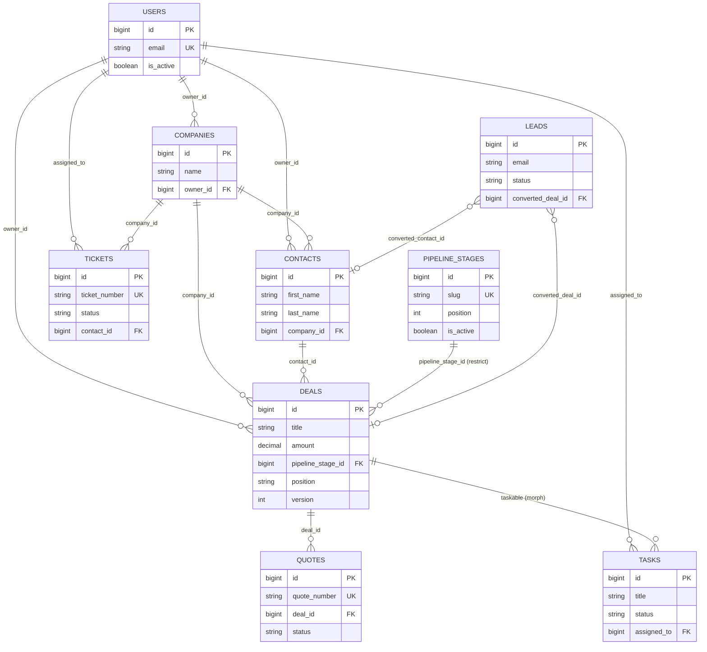

# SIGMA-CRM

SIGMA-CRM, kapalı devre (yalnızca davetle erişilen) bir kurumsal CRM sistemidir. Laravel 12 + React 18 tabanlı bir monorepo olarak geliştirilir.

## Proje Yapısı

| Dizin | Açıklama |
| --- | --- |
| `backend/` | Laravel 12 tabanlı REST API (Sanctum ile kimlik doğrulama, Reverb ile gerçek zamanlı olaylar). |
| `frontend/` | React 18 + Vite ile geliştirilen tek sayfa uygulama (SPA). |
| `docs/` | Yol haritası, ilerleme kaydı ve tasarım sistemi dokümanları. |

İlgili dokümanlar:
- [docs/ROADMAP.md](docs/ROADMAP.md)
- [docs/PROGRESS.md](docs/PROGRESS.md)

## Teknoloji Yığını

| Katman | Teknoloji | Sürüm / Not |
| --- | --- | --- |
| Backend | Laravel | 12.67.0 |
| Backend | Laravel Sanctum | Kimlik doğrulama (SPA cookie tabanlı) |
| Backend | spatie/laravel-permission | Rol ve yetki yönetimi |
| Backend | PHP | 8.2.12 |
| Frontend | React | 18.3.1 |
| Frontend | Vite | Build/dev sunucusu |
| Frontend | React Router | İstemci tarafı yönlendirme |
| Frontend | TanStack Query | Sunucu state yönetimi / veri çekme |
| Frontend | Zustand | İstemci state yönetimi |
| Frontend | Tailwind CSS | 4.3.3 |
| Veritabanı | MySQL / MariaDB | 10.4.32 (MariaDB), veritabanı adı: `sigma_crm` |
| Realtime | Laravel Reverb + Laravel Echo | WebSocket sunucusu ve istemci kütüphanesi |
| Queue / Cache | Redis | 8.0.5 (WSL2 üzerinde) |
| Araç | Node.js | 26.7.0 |
| Loglama | spatie/laravel-activitylog ^4.12 + maatwebsite/excel ^3.1 | audit trail, CSV/XLSX export |
| Sürükle-bırak | @dnd-kit/core ^6.3 + sortable ^10 | Kanban panosu, klavye erişilebilirliği ile |

> **Not:** Proje başlangıçta Laravel 11 hedefliyordu. Laravel 11.x'te yamalanmamış güvenlik açıkları (CVE-2026-48019 dahil) bulunduğu ve 11.x hattında düzeltme olmadığı için Laravel 12'ye geçildi. Ayrıntı: `docs/PROGRESS.md` karar günlüğü.

## Ön Koşullar

Bu proje aşağıdaki ortamda doğrulanmıştır:

| Bileşen | Sürüm / Konum | Not |
| --- | --- | --- |
| PHP | 8.2.12 — `C:\xampp\php\php.exe` | `zip` ve `intl` eklentileri açık olmalı |
| Composer | 2.10.2 — `C:\xampp\php\composer.bat` | |
| MariaDB | 10.4.32 — `127.0.0.1:3306` | Kullanıcı `root`, şifre boş, utf8mb4. **Windows servisi olarak kurulu değildir**, XAMPP Control Panel'den başlatılmalıdır |
| Redis | 8.0.5 — WSL2 Ubuntu üzerinde, `127.0.0.1:6379` | Memurai kurulu değil |
| Node.js | v26.7.0 | |
| npm | 11.19.0 | |

Ek notlar:
- PHP için `redis` C eklentisi kurulu değildir; bu nedenle backend'de `predis/predis` paketi kullanılır (`REDIS_CLIENT=predis`).
- `C:\xampp\php` kullanıcı PATH'ine eklenmiştir. Bu değişiklik yalnızca **yeni açılan terminallerde** geçerlidir; eski terminallerde `php` komutu yerine tam yol (`C:\xampp\php\php.exe`) kullanılmalıdır.

### Kurulum Adımları (Ön Koşullar)

**XAMPP:** PHP 8.2 veya üzeri şarttır — daha düşük bir sürüm Laravel 12'yi çalıştıramaz. XAMPP kurulumundan sonra `php.ini` dosyasında aşağıdaki satırların başındaki `;` işaretini kaldırın:
```ini
extension=zip
extension=intl
```

**Composer:** XAMPP ile birlikte gelen `composer.bat` kullanılabilir veya [getcomposer.org](https://getcomposer.org/) üzerinden ayrıca kurulabilir.

**Redis (Windows'ta iki seçenek):**
- **(a) WSL2 + Ubuntu (bu projede kullanılan yöntem):**
  ```
  wsl --install
  sudo apt install redis-server
  sudo service redis-server start
  ```
  Windows tarafından `127.0.0.1:6379` üzerinden erişilebilir.
- **(b) Memurai:** Windows-native Redis servisi, WSL2 istemeyenler için alternatiftir.

## Kurulum

1. Repoyu klonlayın.
2. MySQL'i başlatın: XAMPP Control Panel → **MySQL** → **Start**. phpMyAdmin kullanacaksanız **Apache**'yi de başlatın.
3. Veritabanını oluşturun (veritabanı adı **`sigma_crm`** olmalıdır):
   - phpMyAdmin üzerinden, veya
   - komut satırından:
     ```
     mysql -u root -e "CREATE DATABASE sigma_crm CHARACTER SET utf8mb4 COLLATE utf8mb4_unicode_ci;"
     ```
4. Redis'i başlatın (WSL içinden): `sudo service redis-server start`. Doğrulamak için: `redis-cli ping` → `PONG` dönmelidir.
5. Backend kurulumu:
   ```
   cd backend
   composer install
   cp .env.example .env
   php artisan key:generate
   php artisan migrate --seed
   ```
   Bu komut roller, izinler ve Super Admin hesabını oluşturur.
6. Frontend kurulumu:
   ```
   cd frontend
   npm install
   cp .env.example .env
   ```
   Not: Tailwind v4 kullanıldığı için `tailwind.config.js` yoktur; tema `frontend/src/styles/tokens.css` içinde `@theme` ile tanımlanır.

## Çalıştırma

Uygulamanın tam çalışması için dört süreç, dört ayrı terminalde çalıştırılmalıdır:

| Süreç | Komut | Port |
| --- | --- | --- |
| API | `cd backend && php artisan serve` | 8000 |
| WebSocket (Reverb) | `cd backend && php artisan reverb:start` (ws://localhost:8080) | 8080 |
| Queue worker | `cd backend && php artisan queue:work` | — |
| Frontend | `cd frontend && npm run dev` | 5173 |

Alternatif olarak, kök dizindeki **`dev.bat`** dosyası çalıştırılarak dört süreç de tek komutla, ayrı pencerelerde başlatılabilir.

Zamanlanmış görevler için `php artisan schedule:work` gerekir — `logs:prune` her gün 03:17'de eski log kayıtlarını budar (page_visit_logs 90 gün, session_logs ve activity_log 365 gün).

## Sorun Giderme

- **`php` komutu bulunamıyor:** PATH değişikliği yalnızca yeni açılan terminallere yansır — yeni bir terminal açın veya `C:\xampp\php\php.exe` tam yolunu kullanın.
- **MySQL bağlantı hatası:** XAMPP Control Panel'de MySQL servisinin çalıştığından ve `sigma_crm` veritabanının oluşturulduğundan emin olun.
- **Redis bağlantı hatası:** WSL içinde `sudo service redis-server start` komutunu çalıştırın. `backend/.env` dosyasında `REDIS_CLIENT=predis` olmalıdır (phpredis C eklentisi kurulu değildir).
- **Reverb'e bağlanılamıyor:** `php artisan reverb:start` sürecinin çalıştığından, `backend/.env` ve `frontend/.env` dosyalarındaki `REVERB_*` / `VITE_REVERB_*` değerlerinin birbiriyle eşleştiğinden ve 8080 portunun boş olduğundan emin olun.
- **CORS / 419 hatası:** `backend/.env` içindeki `SANCTUM_STATEFUL_DOMAINS` ve `FRONTEND_URL` değerlerinin doğru olduğundan ve frontend isteklerinde `withCredentials: true` kullanıldığından emin olun.
- **`composer install` güvenlik uyarısıyla duruyor** → Composer 2.10+ güvenlik açığı olan sürümlerin kurulumunu engeller. Bu doğru davranıştır; bloğu kapatmak yerine paketi güvenli sürüme yükseltin (`composer audit` ile kontrol edin).
- **Giriş yaptım ama her sayfa 403 PASSWORD_CHANGE_REQUIRED veriyor** → Hesabınız geçici şifreyle oluşturulmuş; /change-password ekranından şifrenizi değiştirin. Bu kasıtlı bir güvenlik davranışıdır, bkz. docs/AUTH-FLOWS.md
- **WebSocket bağlanmıyor / private kanal aboneliği reddediliyor** → (1) `php artisan reverb:start` çalışıyor mu, (2) `backend/.env` içinde tek bir `REVERB_APP_ID` var mı (`reverb:install` ikinci blok ekleyebiliyor), (3) `backend/.env` ile `frontend/.env` içindeki anahtarlar eşleşiyor mu, (4) `config/cors.php`'de `broadcasting/auth` yolu tanımlı mı.
- **Yeni eklediğim klasör git'te görünmüyor** → `.gitignore`'daki çıplak dizin kuralları (`logs`, `dist`) her derinlikte eşleşir. `git check-ignore -v <dosya>` ile hangi kuralın engellediğini bulun.
- **CSV export'ta Türkçe karakterler bozuk** → Dosya UTF-8 BOM ile üretiliyor; Excel'de "Veri → Metinden" yerine dosyayı doğrudan açın.
- **CSV import'ta Türkçe karakterler bozuk** → Şablonu `/api/leads/import/template` adresinden indirin; UTF-8 BOM ile üretiliyor. Kendi dosyanızı UTF-8 olarak kaydedin.
- **Duplicate uyarısı çıkmıyor** → Kontrol en az bir alan (e-posta, telefon, ad veya soyad) dolduğunda ve 500ms yazma duraklamasından sonra çalışır. Hiçbir alan doluysa değilse istek gönderilmez (sunucu 422 döner).
- **Kanban'da kart taşıyınca "başkası taşıdı" uyarısı alıyorum** → Bu kasıtlı bir koruma. Kartın sizde görünen sürümü bayatlamış demektir (başka biri sizden önce taşımış). Kart otomatik olarak gerçek konumuna oturur; tekrar taşıyabilirsiniz.
- **Kartı kayıp aşamasına sürükleyince neden soruyor** → `lost_reason` zorunludur; kayıp nedeni olmadan taşıma sunucu tarafından reddedilir (422). Kazanma nedeni opsiyoneldir.

## API Endpoint Listesi

_Faz 2, 4, 5, 6 ve 7 uçları eklendi; kalanı Faz 13'te tamamlanacak._

| Metot | Yol | İzin / Koruma | Açıklama |
| --- | --- | --- | --- |
| GET | `/sanctum/csrf-cookie` | — (public) | CSRF çerezini alır, login'den önce çağrılır |
| POST | `/api/login` | — (public, rate limited) | E-posta + şifre ile oturum açar |
| POST | `/api/password/forgot` | — (public, kapalı devre) | Admin onaylı şifre sıfırlama talebi; her durumda 202 döner |
| POST | `/api/logout` | Kimlik doğrulama gerekli | Oturumu kapatır |
| GET | `/api/me` | Kimlik doğrulama gerekli | Oturum açan kullanıcının bilgilerini döner |
| POST | `/api/password/change` | Kimlik doğrulama gerekli | Şifre değiştirir (`must_change_password` beyaz listesinde) |
| GET | `/api/users` | `users.manage` | Kullanıcıları sayfalı/sıralı/filtreli listeler |
| POST | `/api/users` | `users.manage` | Yeni kullanıcı oluşturur |
| GET | `/api/users/{id}` | `users.manage` | Kullanıcı detayını döner |
| PATCH | `/api/users/{id}` | `users.manage` | Kullanıcıyı günceller |
| DELETE | `/api/users/{id}` | `users.manage` | Kullanıcıyı soft-delete yapar |
| PATCH | `/api/users/{id}/active` | `users.manage` | Kullanıcıyı aktif/pasif yapar (anlık session revoke) |
| POST | `/api/users/{id}/reset-password` | `users.manage` | Kullanıcının şifresini sıfırlar |
| GET | `/api/roles` | `users.manage` | Rol listesini döner |
| POST | `/broadcasting/auth` | Kimlik doğrulama gerekli (`auth:sanctum` + `EnsureUserIsActive`) | Private/presence kanal aboneliğini yetkilendirir |
| GET | `/api/presence/online` | Kimlik doğrulama gerekli (`auth:sanctum` + `EnsureUserIsActive` + `EnsurePasswordIsChanged`) | O an online olan kullanıcıları döner (Reverb API kaynaklı) |
| GET | `/api/logs/sessions` | `logs.view` | Oturum loglarını (login/logout/failed_login/locked_out) sayfalı/sıralı/filtreli listeler |
| GET | `/api/logs/page-visits` | `logs.view` | Sayfa ziyareti loglarını sayfalı/sıralı/filtreli listeler |
| GET | `/api/logs/activities` | `logs.view` | Audit trail (activity log) kayıtlarını sayfalı/sıralı/filtreli listeler |
| GET | `/api/logs/export` | `logs.export` | Log kayıtlarını CSV veya XLSX olarak dışa aktarır (`?format=csv|xlsx`, tavan 50.000 satır) |
| POST | `/api/page-visits` | Kimlik doğrulama gerekli | Yeni bir sayfa ziyareti kaydı açar (önceki açık ziyareti otomatik kapatır) |
| PATCH | `/api/page-visits/{id}/heartbeat` | Kimlik doğrulama gerekli (yalnız kendi ziyareti — IDOR korumalı) | Açık ziyaretin birikimli süresini günceller (30 sn aralıkla) |
| GET | `/api/leads` | `leads.view` | Lead'leri sayfalı/sıralı/filtreli/aramalı listeler |
| POST | `/api/leads` | `leads.create` | Yeni lead oluşturur |
| GET | `/api/leads/{id}` | `leads.view` | Lead detayını döner |
| PATCH | `/api/leads/{id}` | `leads.update` | Lead'i günceller (dönüşmüş lead 403) |
| DELETE | `/api/leads/{id}` | `leads.delete` | Lead'i soft-delete yapar (dönüşmüş lead 403) |
| POST | `/api/leads/check-duplicates` | `leads.view` | E-posta/telefon/isim üzerinden duplicate aday kontrolü yapar |
| POST | `/api/leads/{id}/convert` | `leads.convert` | Lead'i contact + (varsa) company + (opsiyonel) deal'e dönüştürür |
| PATCH | `/api/leads/{id}/assign` | `leads.update` | Lead'i bir kullanıcıya atar |
| POST | `/api/leads/import` | `leads.import` | CSV toplu import başlatır (500 satır altı senkron, üstü kuyruklu — 202 + `batch_id`) |
| GET | `/api/leads/import/template` | `leads.import` | Import için boş CSV şablonunu indirir (UTF-8 BOM) |
| GET | `/api/leads/import/{batch}` | `leads.import` (yalnız batch'i başlatan kullanıcı) | Kuyruklu import'un durumunu/sonuç raporunu döner |
| GET | `/api/contacts` | `contacts.view` | Kişileri sayfalı/sıralı/filtreli/aramalı listeler |
| POST | `/api/contacts` | `contacts.create` | Yeni kişi oluşturur |
| GET | `/api/contacts/{id}` | `contacts.view` | Kişi detayını döner |
| PATCH | `/api/contacts/{id}` | `contacts.update` | Kişiyi günceller |
| DELETE | `/api/contacts/{id}` | `contacts.delete` | Kişiyi soft-delete yapar (açık fırsatı varsa 422) |
| GET | `/api/contacts/{id}/timeline` | `contacts.view` | Kişinin birleşik iletişim geçmişi timeline'ını döner |
| GET | `/api/companies` | `companies.view` | Firmaları sayfalı/sıralı/filtreli/aramalı listeler |
| POST | `/api/companies` | `companies.create` | Yeni firma oluşturur |
| GET | `/api/companies/{id}` | `companies.view` | Firma detayını döner |
| PATCH | `/api/companies/{id}` | `companies.update` | Firmayı günceller |
| DELETE | `/api/companies/{id}` | `companies.delete` | Firmayı soft-delete yapar (açık fırsatı varsa 422) |
| GET | `/api/companies/{id}/timeline` | `companies.view` | Firmanın (bağlı kişiler dahil) birleşik timeline'ını döner |
| GET | `/api/tags` | Kimlik doğrulama gerekli | Etiket listesini döner |
| POST | `/api/tags` | Kimlik doğrulama gerekli | Yeni etiket oluşturur |
| GET | `/api/custom-fields` | Kimlik doğrulama gerekli | Tanımlı özel alanları döner |
| GET | `/api/deals` | `deals.view` | Fırsatları sayfalı/sıralı/filtreli/aramalı listeler (`meta.totals`: count/total_amount/open_amount/won_amount/lost_amount) |
| GET | `/api/deals/board` | `deals.view` | Kanban panosu için aşama başına kartları döner (`?per_stage=`, `has_more`, `meta.total_amount`) |
| POST | `/api/deals` | `deals.create` | Yeni fırsat oluşturur (`position`/`version`/`status` sunucuda üretilir) |
| GET | `/api/deals/{id}` | `deals.view` | Fırsat detayını döner |
| PATCH | `/api/deals/{id}` | `deals.update` | Fırsatı günceller (`pipeline_stage_id`/`position`/`version`/`status` reddedilir — 422) |
| DELETE | `/api/deals/{id}` | `deals.delete` | Fırsatı soft-delete yapar (kazanılmış/kaybedilmiş fırsat 403) |
| PATCH | `/api/deals/{id}/move` | `deals.move` | Fırsatı Kanban'da başka aşamaya/pozisyona taşır; komşu id'leri + `version` alır. **409 DEAL_VERSION_CONFLICT dönebilir** |
| PATCH | `/api/deals/{id}/assign` | `deals.update` | Fırsatı bir kullanıcıya atar |
| GET | `/api/pipeline-stages` | `deals.view` | Aktif pipeline aşamalarını sıralı döner |

## ER Diyagramı

Aşağıda yalnızca ana CRM varlıkları özet olarak gösterilmiştir. Tüm 38 tablonun kolon dökümü, foreign key silme davranışları, index stratejisi ve tasarım kararlarının gerekçeleri için bkz. **[docs/DATABASE.md](docs/DATABASE.md)**.



## Varsayılan Hesaplar

| E-posta | Şifre | Rol |
| --- | --- | --- |
| `admin@sigma-crm.local` | `SigmaAdmin!2026` | Super Admin |

> **Uyarı:** Bu yalnızca yerel geliştirme içindir. Hesap `must_change_password=true` ile gelir; ilk girişte şifre değiştirme ekranı zorunludur ve değiştirilmeden hiçbir modüle erişilemez. Üretimde seeder'daki şifre mutlaka değiştirilmelidir.

Sistem kapalı devredir: public kayıt yoktur, yeni hesapları yalnızca Super Admin oluşturur.

## Güvenlik Notu

`.env` dosyaları asla repoya girmez; `.env.example` dosyaları eksiksiz tutulur. Sistem kapalı devredir — herkese açık kayıt (public registration) yoktur, kullanıcı hesapları yalnızca Super Admin tarafından oluşturulur.
