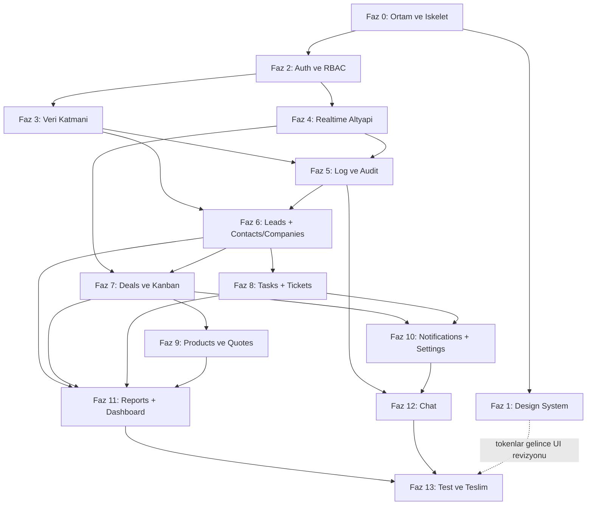

# SIGMA-CRM — Yol Haritası (ROADMAP)

> Kaynaklar: `PRODUCT-BRIEF.md` (ürün gereksinimleri) + `docs/ENGINEERING-RULES.md` (şerit çalışma kuralları).
> Canlı durum takibi için: `docs/PROGRESS.md` (her oturum başında okunur).

---

## 1. Genel Bakış & Prensipler

**Kapsam:** Kurumsal seviye, production-ready, **kapalı devre** CRM. Monorepo: `backend/` (Laravel 12, PHP 8.2+, Sanctum SPA auth) + `frontend/` (React 18 + Vite + React Router + TanStack Query + Zustand + Tailwind). Veritabanı MySQL (XAMPP, `127.0.0.1:3306`, root/şifresiz). Gerçek zamanlı katman: Laravel Reverb + Laravel Echo + Redis (broadcast + queue + cache + presence). Kuyruk: Redis queue (+ opsiyonel Horizon).

**Kapalı devre tanımı:** Public register YOK. Hesaplar yalnızca Super Admin tarafından Kullanıcı Yönetimi modülünden açılır; ilk Super Admin seeder ile gelir. Pasifleştirilen kullanıcı WebSocket üzerinden anında düşürülür (session revoke). "Şifremi unuttum" yalnızca admin onaylı çalışır. RBAC: `spatie/laravel-permission`, granüler izinler (`deals.create`, `logs.view` ...), her endpoint'te Policy/Gate.

**Katmanlı mimari (backend):** `Controller → Service → Repository`. Business logic controller'da olmaz.
- `backend/app/Http/Controllers/Api/` — ince controller'lar
- `backend/app/Services/` — iş kuralları (ör. `Services/Deals/DealService.php`)
- `backend/app/Repositories/` — Eloquent erişimi (ör. `Repositories/DealRepository.php`)
- `backend/app/Http/Requests/` — Form Request validasyon; `backend/app/Http/Resources/` — API Resource
- `backend/app/Policies/`, `backend/app/Events/`, `backend/app/Jobs/`, `backend/app/Observers/`

**API response sözleşmesi:** Her endpoint API Resource üzerinden döner: başarıda `{ "data": ..., "meta": {...} }` (liste uçlarında `meta.pagination`: `current_page`, `per_page`, `total`, `last_page`), hatada `{ "errors": { "message": ..., "code": ..., "fields": {...} } }` (422'de alan bazlı). Bu sözleşme tüm fazlar ve tüm şeritler için bağlayıcıdır.

**Feature-based frontend:**
- `frontend/src/features/<modül>/` → `api/` (TanStack Query hook'ları), `components/`, `pages/`, `types.ts`
- Modüller: `auth`, `users`, `dashboard`, `leads`, `contacts`, `companies`, `deals`, `tasks`, `tickets`, `products`, `quotes`, `reports`, `notifications`, `settings`, `logs`, `chat`
- Ortak: `frontend/src/components/ui/` (primitive'ler), `frontend/src/lib/` (`axios.ts`, `echo.ts`, `queryClient.ts`), `frontend/src/stores/` (Zustand), `frontend/src/hooks/`

**Değişmez kalite çizgisi:** Ham SQL yok (`DB::raw` zorunluysa bind'lı), `dangerouslySetInnerHTML` yok, mass-assignment `$fillable`, IDOR için sahiplik/yetki kontrolü, tüm liste ekranlarında server-side pagination/sort/filter/search, her ekranda empty/loading(skeleton)/error state + toast, WCAG 2.1 AA, dark/light mode.

---

## 2. Faz Tablosu

| Faz | İsim | Çıktı (Deliverable) | Bağımlılık | Bitti Kriteri (DoD) |
|---|---|---|---|---|
| 0 | Ortam & İskelet | XAMPP/MySQL/Redis (Memurai veya WSL) kurulum notları README taslağında; `backend/` Laravel 12 + `frontend/` Vite iskeleti; `.env.example` eksiksiz; Pint + ESLint/Prettier; klasör yapısı | — (ortam 2026-08-23'te kuruldu ve doğrulandı) | ✅ TAMAMLANDI (2026-08-23). `composer install` + `php artisan serve` ve `npm run dev` ayağa kalkıyor; `.env` git'te yok; lint komutları temiz |
| 1 | Design System | Figma'dan design token'lar (renk/tipografi/spacing/radius/shadow, dark+light) → `frontend/src/styles/tokens.css` (Tailwind v4 `@theme`); UI primitive'leri: Button, Input, Select, Modal, Table, Card, Toast, Skeleton, EmptyState; `/showcase` sayfası | 0 | ✅ TAMAMLANDI (2026-08-23). DoD: tüm primitive'ler showcase'te iki temada, WCAG AA kontrast doğrulanmış Token kaynağı: docs/DESIGN-SYSTEM.md |
| 2 | Auth & RBAC & Kullanıcı Yönetimi | Sanctum SPA + CSRF akışı, login ekranı ("beni hatırla", kilitlenme uyarısı), rate limit (5/dk + artan bekleme), roller (Super Admin, Admin, Satış Müdürü, Satış Temsilcisi, Destek Temsilcisi, İzleyici) + granüler izinler, Super Admin seeder, Kullanıcı Yönetimi CRUD, aktif/pasif + anlık session revoke, admin onaylı şifre sıfırlama, route guard | 0 (UI cilası 1'e) | ✅ TAMAMLANDI (2026-08-23). Login/logout uçtan uca; pasif yapılan kullanıcı anında atılıyor; her endpoint Policy'li; İzleyici hiçbir şey yazamıyor |
| 3 | Veri Katmanı | Tüm migration + factory + seeder (users, roles, permissions, leads, contacts, companies, deals, pipeline_stages, tasks, activities, tickets, products, quotes, quote_items, messages, conversations, conversation_user, notifications, activity_logs, page_visit_logs, session_logs, custom_fields, custom_field_values, tags, taggables, attachments, settings); FK + index + soft delete; mermaid ER diyagramı | 2 | ✅ TAMAMLANDI (2026-08-23). `php artisan migrate:fresh --seed` tek komutla dolu demo sistem; phpMyAdmin'de temiz şema; ER diyagramı README'de |
| 4 | Realtime Altyapı | Reverb sunucu + Echo client + Redis broadcast/queue; kanal mimarisi: `private-user.{id}`, `presence-online`, `presence-record.{type}.{id}`, whisper altyapısı; "online kullanıcılar" presence temeli | 2 | 🟨 Backend tamamlandı (2026-08-23), frontend sürüyor. İki tarayıcıda presence listesi canlı; private kanal yetki kontrolü çalışıyor; `reverb:start` + `queue:work` README'de |
| 5 | Log & Audit | `session_logs` (login/logout, IP, user-agent, cihaz/tarayıcı, süre, başarısız denemeler), `page_visit_logs` (route change + heartbeat ile sayfada kalınan süre), audit trail (`spatie/laravel-activitylog`, JSON diff eski→yeni), Loglar sayfası (`logs.view`): canlı akış sekmesi (WebSocket), online panel (kim/hangi sayfa/ne kadardır), filtre (kullanıcı/tarih/aksiyon/modül), CSV/Excel export (`maatwebsite/excel`) | 3, 4 | Her CRUD audit'e düşüyor; canlı akışta anlık log; heartbeat süre ölçümü doğru; export çalışıyor |
| 6 | Leads + Contacts/Companies | Leads: kaynak takibi, skorlama, atama, CSV toplu import, lead→müşteri dönüştürme, duplicate tespiti. Contacts/Companies: ilişkili kayıtlar, iletişim geçmişi timeline, etiketleme, custom fields | 3, 5 (audit otomatik işler) | Liste ekranları server-side pagination/sort/filter/search; dönüştürme akışı uçtan uca; tüm işlemler audit'te |
| 7 | Deals & Kanban Pipeline | dnd-kit Kanban, aşama bazlı olasılık/tutar, kazanma-kaybetme nedenleri, tahmini kapanış; her hareket WebSocket ile diğer kullanıcılara anlık yansır (optimistic update + sunucu doğrulaması) | 4, 6 | İki tarayıcıda sürükle-bırak anlık senkron; çakışmada sunucu kazanır ve UI geri alır |
| 8 | Tasks/Activities + Tickets | Görev atama, hatırlatıcı, takvim görünümü, arama/toplantı/e-posta aktivite kayıtları; Tickets: öncelik, SLA sayacı, atama, durum akışı, iç notlar | 6 | Takvim ve liste görünümleri çalışır; SLA sayacı canlı; atamalar bildirim eventi üretiyor (Faz 10'da tüketilecek) |
| 9 | Products & Quotes | Ürün kataloğu, fiyat listeleri, teklif oluşturma + PDF (`barryvdh/laravel-dompdf`), teklif→fırsat bağlantısı | 7 | Tekliften PDF indiriliyor; `quote_items` toplamları doğru; teklif deal'a bağlı |
| 10 | Notifications + Settings | Bildirim merkezi (atama, mention, deal güncellemesi — Redis+WS anlık push, okunmamış sayaç); Settings: şirket profili, pipeline aşama editörü, custom field yönetimi, e-posta şablonları, rol/izin matrisi | 4, 7, 8 | Bildirim anlık düşüyor ve kalıcı; pipeline aşaması değişince Kanban güncelleniyor; izin matrisi çalışıyor |
| 11 | Reports + Dashboard | Raporlar: satış performansı, kullanıcı performansı, kaynak analizi, dönüşüm; tarih filtreli + export. Dashboard: KPI kartları (aylık gelir, açık fırsatlar, dönüşüm oranı, aktivite sayısı), satış hunisi, gelir trendi (Recharts), son aktiviteler, görev özeti — WebSocket ile canlı | 6, 7, 8, 9 | Rakamlar seed verisiyle doğrulanmış; dashboard canlı güncelleniyor; raporlar export edilebilir |
| 12 | Chat | DM + grup/kanal, yazıyor... (whisper), okundu bilgisi (çift tik), online/offline/son görülme (presence), dosya/görsel paylaşımı, mesaj arama, @mention, okunmamış sayaçları; deal/ticket detayında kayda bağlı sohbet paneli | 4, 5, 10 (mention→bildirim) | İki kullanıcı arası anlık mesaj + tik + yazıyor göstergesi; kayda bağlı panel canlı; mesajlar MySQL'de, fan-out Redis'te |
| 13 | Test, Sertleştirme & Teslim | Feature testleri (auth, yetki, deal CRUD, log kaydı, chat mesajı); güvenlik header'ları (CSP, HSTS, X-Frame-Options, X-Content-Type-Options, Referrer-Policy); upload validasyonu (MIME/boyut/rastgele isim/public dışı saklama); IDOR + mass-assignment kontrol turu; README final (kurulum + API endpoint listesi + ER); son kabul turu | 0–12 | `php artisan test` yeşil; header'lar yanıtlarda doğrulanmış; Bölüm 6 kabul kriterlerinin tamamı sağlanıyor |

**Faz 1 durumu (2026-08-23 güncellendi):** Figma linki geldi ve dosya Figma REST API ile okundu (`Dashboard CRM (Community) (Copy)`, key `tlJ6qKhhmbBZAKIYaCIolE`). Tüm design token'ları ölçülüp `docs/DESIGN-SYSTEM.md` dosyasına yazıldı — bu doküman token'lar için tek doğruluk kaynağıdır. Kalan adımlar:
1. ✅ Token extraction (renk, tipografi, spacing, radius, shadow, layout) — tamamlandı
2. ✅ `frontend/src/styles/tokens.css` aktarımı — Tailwind v4 `@theme` bloğu + `:root` / `[data-theme="dark"]` CSS custom property'leri (v4'te `tailwind.config.js` yoktur)
3. ✅ Primitive'lerin inşası: Button, Input, Select, Modal, Table, Card, Toast, Skeleton, EmptyState, Badge, Avatar, Pagination, Tabs
4. ✅ `/showcase` sayfası — tüm primitive + state'ler
5. ✅ WCAG 2.1 AA kontrast denetimi — oranlar `docs/DESIGN-SYSTEM.md` §1.6'da hesaplandı; `/showcase` sayfası her iki temada gözle doğrulandı (2026-08-23)

**Açık tema:** Figma dosyasında yalnızca koyu tema frame'i çizilmişti. Açık tema paleti 2026-08-23'te karara bağlandı ve WCAG 2.1 AA için doğrulandı — dört accent ile text-muted, beyaz zeminde 4.5:1'i geçmedikleri için koyulaştırıldı. Değerler ve 18 çiftlik kontrast tablosu: `docs/DESIGN-SYSTEM.md` §1.6.

**Bilgi mimarisi kararı:** Kaynak template (DexignZone) genel bir admin temasıdır; menüsünde Employees/Core HR/Finance/Projects gibi bizim CRM'imizde olmayan öğeler var. **Tasarımın görsel dili alınır, bilgi mimarisi alınmaz** — modül listesi `PRODUCT-BRIEF.md`'den gelir. Eşleme tablosu: `docs/DESIGN-SYSTEM.md` §8.

### 2.1 Faz Detayları (paketler, komutlar, kilit dosyalar)

**Faz 0 — Ortam & İskelet**
> **Ortam durumu — KURULDU ve DOĞRULANDI (2026-08-23):** PHP 8.2.12 (`C:\xampp\php`, `zip`+`intl` açık), Composer 2.10.2, MariaDB 10.4.32 (çalışıyor, utf8mb4), Redis 8.0.5 (WSL2, `127.0.0.1:6379`), Node 26.7.0 / npm 11.19.0. Ayrıntılı tablo: `docs/PROGRESS.md` → Ortam Durumu.
>
> Bilinmesi gerekenler:
> - `C:\xampp\php` kullanıcı PATH'inde mevcut (`php`, `composer` bare komut olarak çalışır). Uyarı: Windows'ta ortam değişkenleri yalnızca yeni süreçlere miras kalır — oturum/terminal PATH değişikliğinden önce açıldıysa komutlar bulunamaz; yeni terminal açmak veya tam yol (`C:\xampp\php\php.exe`) kullanmak gerekir.
> - MariaDB Windows servisi olarak kurulu değil; makine yeniden başlatılınca XAMPP Control Panel'den başlatılmalı.
> - Redis WSL2 Ubuntu üzerinde çalışıyor — Memurai kurulmadı, gerekmedi.
> - PHP `redis` C eklentisi yok → `predis/predis` kullanılacak.
>
> **Faz 0 sonucu (2026-08-23):** Kurulu sürümler — Backend: Laravel 12.67.0, sanctum 4.3.3, spatie/laravel-permission 6.25.0, predis 3.6.0, pint 1.30.4 (PHP 8.2.12). Frontend: React 18.3.1, Tailwind 4.3.3, Vite, TypeScript, ESLint flat config + Prettier. Doğrulamalar: `composer audit` temiz, Redis ping PONG, Pint passed, `npm run build`/`lint`/`typecheck` temiz.
> Veritabanı `sigma_crm` HENÜZ OLUŞTURULMADI ve hiçbir migration çalıştırılmadı (Faz 3).
- Backend: `composer create-project laravel/laravel backend` (Laravel 12), ardından `composer require laravel/sanctum spatie/laravel-permission` + `predis/predis`.
- Frontend: `npm create vite@latest frontend -- --template react-ts`, ardından `npm i react-router-dom @tanstack/react-query zustand axios laravel-echo pusher-js` + `npm i -D tailwindcss @tailwindcss/vite eslint prettier`.
- `.env.example`: `DB_HOST=127.0.0.1`, `DB_PORT=3306`, `DB_USERNAME=root`, `DB_PASSWORD=` (XAMPP varsayılanları), `REDIS_*`, `REVERB_*`, `BROADCAST_CONNECTION=reverb`, `QUEUE_CONNECTION=redis`, `CACHE_STORE=redis`, `SESSION_DRIVER=redis`.
- Redis doğrulama: `php artisan tinker` → `Illuminate\Support\Facades\Redis::ping()` (WSL2'deki Redis 8.0.5'e bağlanır).
- Lint: `backend/pint.json` (`vendor/bin/pint`), `frontend/.eslintrc.cjs` + `.prettierrc`.
- Kök: `dev.bat` (4 süreç: `php artisan serve`, `php artisan reverb:start`, `php artisan queue:work`, `npm run dev`), `README.md` taslağı, `.gitignore` (`.env`, `node_modules`, `vendor`).

**Faz 1 — Design System** (token'lar çıkarıldı — bkz. docs/DESIGN-SYSTEM.md)
- Kilit dosyalar: `frontend/src/styles/tokens.css` (CSS custom properties, `[data-theme="dark"]` varyantları), `frontend/src/components/ui/*.tsx`, `frontend/src/pages/Showcase.tsx` (`/showcase` route'u yalnız dev ortamında).
- Layout sabitleri: sidebar 240px, sağ drawer 340px, baskın kart padding'i 20px, taban font 13px/20px (Poppins). Primitive prop imzaları Faz 0 sonunda sabitlenir.

> **Faz 1 sonucu (2026-08-23):** `src/styles/tokens.css` (Tailwind v4 `@theme inline` + `[data-theme]`), `src/stores/themeStore.ts` + `src/hooks/useTheme.ts` (light/dark/system, OS değişimini dinler), `src/lib/cn.ts`. 15 primitive: Button, Input, Select, Textarea, Checkbox, Badge, Avatar(+Group), Card(+Header/Body/Footer), Modal, Table(+alt bileşenler), Toast (Sonner), Skeleton, EmptyState, Pagination, Tabs — barrel `src/components/ui/index.ts` (29 export). Showcase: `/showcase`.
> Doğrulandı: build/typecheck/lint temiz; `src/` altında hex, `rgb()`, varsayılan Tailwind rengi veya `dark:` prefix'i yok. Görsel doğrulama: kullanıcı `/showcase` sayfasını her iki temada gözden geçirdi ve onayladı (2026-08-23).

**Faz 2 — Auth & RBAC**
- Sanctum SPA: `config/sanctum.php` `stateful` domain'leri, `config/cors.php` `supports_credentials: true`; frontend'te önce `GET /sanctum/csrf-cookie` sonra `POST /login`.
- Rate limit: `RateLimiter::for('login', ...)` — 5/dk, artan bekleme; başarısız denemeler `session_logs`'a (Faz 5'te tablo gelince geriye dönük bağlanır, o zamana kadar `Log::warning`).
- Session revoke: kullanıcı pasif yapılınca `UserDeactivated` eventi `private-user.{id}` kanalına düşer; client logout + token/oturum sunucuda geçersiz kılınır. Middleware `EnsureUserIsActive` her istekte kontrol eder.
- Seeder: `database/seeders/RolePermissionSeeder.php` + `SuperAdminSeeder.php`. İzin sözlüğü: `{modül}.{eylem}` (`leads.view|create|update|delete|import|convert`, `deals.*`, `reports.view`, `logs.view`, `users.manage`, `settings.manage`, `chat.use` ...).

> **Faz 2 sonucu (2026-08-23):** `sigma_crm` veritabanı kuruldu (utf8mb4/utf8mb4_unicode_ci); `users` tablosuna `is_active`, `department`, `last_login_at`, `must_change_password`, softDeletes eklendi. 63 izin (`{modül}.{eylem}`, guard `web`), 6 rol: Super Admin (0 izin — `Gate::before` ile tümü), Admin (57), Satış Müdürü (41), Satış Temsilcisi (26), İzleyici (15), Destek Temsilcisi (14). `UserPolicy` (otomatik keşif) — kendi hesabını pasifleştirememe/silememe, Super Admin'i yetkisiz değiştirememe, son aktif Super Admin'in korunması.
> Sanctum SPA cookie session modu (token modu değil): `POST /api/login` (session fixation'a karşı `session()->regenerate()`, 422/403 `USER_DEACTIVATED`), `POST /api/logout`, `GET /api/me`, `POST /api/password/forgot` (kapalı devre, her durumda 202), `POST /api/password/change`. Rate limiting: e-posta+IP karması, dakikada 5 deneme, artan bekleme 1→2→4→8→16→32→60 dk (Redis). Session revoke 3 katmanlı: `EnsureUserIsActive` middleware (asıl güvenlik sınırı), `UserDeactivated` broadcast (Faz 4'te aktifleşecek), remember token rotasyonu. Zorunlu şifre değişimi: `EnsurePasswordIsChanged` middleware, beyaz liste muafiyeti (yalnız `logout`, `me`, `password/change`).
> Kullanıcı Yönetimi: 8 endpoint (Controller → Service → Repository), server-side pagination/sıralama/filtreleme/arama, ham SQL yok, her endpoint'te Policy kontrolü, güçlü şifre politikası (`Password::min(12)->mixedCase()->numbers()->symbols()->uncompromised()`).
> Doğrulama: `php artisan test` → **50 passed / 221 assertions**, `pint --test` passed, frontend build/typecheck/lint temiz. Uçtan uca curl doğrulaması yapıldı.
> **`docs/AUTH-FLOWS.md`, zorunlu şifre değişimi tasarımı ve tehdit modeli için bağlayıcı sözleşmedir** — Faz 3+ endpoint'leri eklenirken bu sözleşmeye uyulmalıdır.

**Faz 3 — Veri Katmanı**
- 26 tablo (Bölüm 2 tablosundaki liste); tümünde `created_at/updated_at`, iş tablolarında `deleted_at` (soft delete), FK'larda `constrained()->cascadeOnDelete()` veya `nullOnDelete()` bilinçli seçilir.
- Kritik index'ler: `deals(pipeline_stage_id, position)`, `page_visit_logs(user_id, entered_at)`, `activity_logs(subject_type, subject_id)`, `messages(conversation_id, created_at)`, `leads(email)` (duplicate tespiti için).
- Her modele factory + gerçekçi Türkçe demo seeder; `DatabaseSeeder` sıralaması FK bağımlılığına göre.
- ER diyagramı mermaid `erDiagram` olarak README'ye.

> **Faz 3 sonucu (2026-08-23):** 39 fiziksel tablo (38'i migration'lardan + Laravel'in `migrations` defter tablosu), 40 foreign key, 13 tabloda soft delete. `migrate:fresh --seed` hatasız, ~2.8 saniye. Zorunlu composite index'ler doğrulandı: `deals(pipeline_stage_id, position)`, `messages(conversation_id, created_at)`, `page_visit_logs(user_id, entered_at)`, `session_logs(user_id, created_at)`. `spatie/laravel-activitylog` ^4.12 kuruldu (5.x PHP 8.4 istiyor, ortamda 8.2 var) — yalnızca `activity_log` tablosu oluşturuldu, loglama mantığı Faz 5'te bağlanacak.
> 20 yeni factory (UserFactory hariç, anlamlı state'lerle) + 5 seeder (`PipelineStageSeeder`, `SettingSeeder`, `CustomFieldSeeder`, `DemoDataSeeder`, `RolePermissionSeeder`/`SuperAdminSeeder` Faz 2'den).
> Demo veri: 9 kullanıcı · 25 firma · 60 kişi · 40 lead · 50 fırsat · 80 görev · 120 aktivite · 30 ticket · 20 ürün · 15 teklif (57 kalem) · 12 etiket (153 ilişki) · 8 konuşma (120 mesaj) · 18 ek · 20 sayfa ziyaret logu · 15 oturum logu. Demo kullanıcı şifresi `Demo!2026Sigma`, `must_change_password=false`.
> Referans bütünlüğü: 24/24 tutarlılık kontrolü temiz (deal durumu ↔ aşama uyumu, tekrarsız `position`, converted lead ↔ FK tutarlılığı, teklif toplamı ↔ kalem toplamı, dm konuşmalarında 2 katılımcı, `unread_count` ↔ `last_read_message_id`, morph alanlarında öksüz kayıt yok...) — `DemoDataSeeder::assertConsistency()` içinde de çalışıyor, ihlalde `RuntimeException` ile transaction geri alınıyor.
> Üretim koruması: `DatabaseSeeder`, demo veriyi yalnızca `! app()->environment('production')` iken üretiyor; `APP_ENV=production` ile test edildi.
> Ayrıntılı şema dökümü, tasarım kararları ve 3 mermaid ER diyagramı: `docs/DATABASE.md`.

**Faz 4 — Realtime Altyapı**
- `composer require laravel/reverb` + `php artisan reverb:install`; `config/broadcasting.php` default `reverb`, event fan-out kuyruğu Redis.
- Kanal sözlüğü (`routes/channels.php`): `private-user.{id}` (kişisel bildirim + revoke), `presence-online` (global online listesi), `presence-record.{type}.{id}` (deal/ticket detayını açık tutanlar), `private-conversation.{id}` (chat, Faz 12).
- `frontend/src/lib/echo.ts`: Echo + `pusher-js` client'ı Reverb'e bağlar; `frontend/src/hooks/usePresence.ts` ortak hook.

> **Faz 4 sonucu — backend (2026-08-23):** `laravel/reverb` v1.11.1, Windows'ta yerel çalışıyor (WSL/`ext-pcntl` gerekmedi). Kapı testi: ham bir Node WebSocket istemcisi `ws://127.0.0.1:8080/app/sigma-key` adresine bağlandı, `pusher:connection_established` aldı, ayrı bir süreçten `artisan tinker` ile dispatch edilen gerçek bir Laravel event'ini kanalda gördü; presence kanalı da doğrulandı (`{"presence":{"count":1,"ids":["2"]}}`) ve Reverb'ün üç HTTP API ucu yanıt verdi.
> Kanal sözlüğü (`routes/channels.php` + `app/Broadcasting/ChannelRegistry.php`): `private-user.{id}` (`$user->id === (int) $id`), `presence-online` (kimliği doğrulanmış + `is_active`; payload id/name/email/role/department), `presence-record.{type}.{id}` (whitelisted `type` + ilgili modülün `.view` izni + kayıt var mı kontrolü), `private-conversation.{id}` (katılımcı pivotu, Faz 12), `private-logs` (`logs.view`, Faz 5), `private-dashboard` (`dashboard.view`, Faz 11).
> Online kullanıcı kaynağı: `App\Broadcasting\OnlineUserRegistry`, Reverb'ün HTTP API'sinden (`/apps/sigma/channels/presence-online/users`) okur — soketlerin sahibi Reverb olduğu için tek doğru kaynak odur, soket kapanınca üye anında düşer, süpürücü job veya `is_online` kolonu gerekmez. Redis yalnızca sarmalayıcı: `sigma:online:ids` (5 sn önbellek), `sigma:online:snapshot` (5 dk, yalnız Reverb erişilemezken okunur, `meta.stale: true` ile). Online'lık asla veritabanından okunmaz/yazılmaz. Uç: `GET /api/presence/online`.
> Route güvenliği: `/broadcasting/auth` → `web → auth:sanctum → EnsureUserIsActive`; `/api/presence/online` → `api → auth:sanctum → EnsureUserIsActive → EnsurePasswordIsChanged`. `password.changed` bilinçli olarak `/broadcasting/auth`'a uygulanmadı (gerekçe: docs/PROGRESS.md karar günlüğü ve kod yorumları).
> Test: 88 passed / 316 assertions (50 mevcut + 38 yeni), Pint passed, `composer audit` temiz.

**Faz 5 — Log & Audit**
- `composer require spatie/laravel-activitylog maatwebsite/excel`.
- Session: `LogSuccessfulLogin/Logout` listener'ları (IP, user-agent, cihaz ayrıştırma), başarısız girişler `Illuminate\Auth\Events\Failed` listener'ı ile.
- Page-visit: `frontend/src/features/logs/usePageTracking.ts` — route change'de `POST /api/page-visits`, 30 sn'de bir `PATCH /api/page-visits/{id}/heartbeat` (yeni satır değil `duration` güncellemesi).
- Audit: loglanacak modellere `LogsActivity` trait'i, `->logOnlyDirty()`; canlı akış `LogCreated` eventi ile `private-logs` kanalına (yalnız `logs.view` yetkisi authorize olur).
- UI: `frontend/src/features/logs/pages/LogsPage.tsx` — sekmeler: Oturum / Gezinme / Aksiyon / Canlı Akış + online kullanıcı paneli; export uçları `GET /api/logs/export?format=csv|xlsx`.

**Faz 6 — Leads + Contacts/Companies**
- Duplicate tespiti: e-posta/telefon/isim benzerliği üzerinden `app/Services/Leads/DuplicateDetector.php`; import öncesi ve kayıt sırasında uyarı.
- CSV import: kuyruğa alınan `ImportLeadsJob` + satır bazlı hata raporu; dönüştürme `LeadConversionService` (lead → contact + company + opsiyonel deal, tek transaction).
- Custom fields: `custom_fields` (tanım) + `custom_field_values` (morph) — Faz 10'daki yönetim ekranının veri temeli burada çalışır durumda olur.

**Faz 7 — Deals & Kanban**
- `npm i @dnd-kit/core @dnd-kit/sortable`; kart taşıma akışı: optimistic update → `PATCH /api/deals/{id}/move` (`{to_stage_id, position, version}`) → başarıda `DealMoved` broadcast'i (`toOthers()`), stale `version`'da 409 + query invalidation ile geri alma.
- `position` fractional-index (string) — araya ekleme toplu renumbering gerektirmez.

**Faz 8 — Tasks/Activities + Tickets**
- Takvim görünümü hafif tutulur (kendi grid bileşenimiz, ağır takvim kütüphanesi yok); hatırlatıcılar `SendTaskReminderJob` (Redis queue, `php artisan schedule:work`).
- SLA: `app/Services/Tickets/SlaService.php` — önceliğe göre hedef süre, kalan süre canlı sayaçla; ihlale yaklaşan ticket'lar bildirim eventi üretir.

**Faz 9 — Products & Quotes**
- `composer require barryvdh/laravel-dompdf`; şablon `backend/resources/views/pdf/quote.blade.php`; para/KDV hesapları tek yerde: `app/Services/Quotes/QuoteCalculator.php` (satır toplamı → indirim → KDV → genel toplam, kuruş yuvarlama kuralı sabit).

**Faz 10 — Notifications + Settings**
- Laravel notifications (`database` + `broadcast` kanalları) — `notifications` tablosu + `private-user.{id}` push; `frontend/src/features/notifications/` zil menüsü + okunmamış sayaç (Zustand).
- Settings: pipeline aşama editörü mevcut deal'ları koruyarak sıralama/ekleme/pasifleştirme yapar (silme yerine pasifleştirme — Kanban kırılmaz).

**Faz 11 — Reports + Dashboard**
- `npm i recharts`; rapor uçları agregasyonu Eloquent/query builder ile yapar (ham SQL yok), tarih aralığı parametreleri standart: `?from=Y-m-d&to=Y-m-d`.
- Dashboard canlılığı: ilgili modül eventleri (`DealMoved`, `DealWon` ...) dashboard kanalını tetikler, TanStack Query `invalidateQueries` ile tazelenir.

**Faz 12 — Chat**
- Model: `conversations` (`type: dm|group|record`), `conversation_user` (pivot: `last_read_message_id`, `unread_count`), `messages` (`body`, `attachment_id`, soft delete).
- Tik makinesi: gönderildi (kayıt OK) → iletildi (broadcast alındı) → okundu (`POST /api/conversations/{id}/read` → `MessageRead` eventi). Yazıyor göstergesi client-to-client whisper (sunucuya yazılmaz).
- Kayda bağlı sohbet: `type=record` konuşma `presence-record.{type}.{id}` ile aynı detay sayfasına gömülür.

**Faz 13 — Test, Sertleştirme & Teslim**
- Testler: `backend/tests/Feature/` — `AuthTest`, `PermissionTest`, `DealCrudTest`, `ActivityLogTest`, `ChatMessageTest`; `RefreshDatabase` + factory'ler.
- Header'lar: `app/Http/Middleware/SecurityHeaders.php` (CSP, HSTS, X-Frame-Options: DENY, X-Content-Type-Options: nosniff, Referrer-Policy).
- Upload: MIME + boyut validasyonu, rastgele isim, `storage/app/attachments` (public dışı), imzalı URL ile servis.
- IDOR turu: her `show/update/delete` ucunda Policy'nin kayıt sahipliği/yetki kontrolü checklist ile doğrulanır; tüm modellerde `$fillable` denetimi.

---

## 3. Paralelleştirme Planı (docs/ENGINEERING-RULES.md Bölüm 3 & 4)

Genel kurallar: Teknik lider dosya değiştirmez — işi böler, sözleşmeyi yazar, çıktıyı inceler ve commit mesajını hazırlayıp kullanıcıya verir (commit'i kullanıcı atar). En kritik parça teknik liderin doğrudan yönettiği/üstlendiği iştir; **aynı anda ikinci bir eşit kritiklikte parça varsa** deneyimli bir şeride verilir (nadiren); hacimli/mekanik her şey standart şeritlere. Aynı dalgada iki şeride asla aynı dosya atanmaz. Düzeltmeler yeni şerit açılmadan aynı şeride iletilir; Bir şerit aynı görevde 2 kez başarısız olursa deneyimli bir şeride, o da başarısız olursa teknik lidere eskalasyon. Hiçbir şerit — teknik lider dahil — Git komutu çalıştırmaz; commit yalnızca kullanıcı tarafından atılır.

| Faz | Dalga | Kritik parça (teknik lider) | 2. kritik parça (deneyimli şerit) | Hacimli parçalar (standart şerit, çakışmayan dosya sahipliği) | Contract-first |
|---|---|---|---|---|---|
| 0 | W1 | Klasör yapısı + `.env.example` + mimari iskelet kararları | — | S1: `backend/` Laravel kurulumu + Pint. S2: `frontend/` Vite kurulumu + ESLint/Prettier + `src/lib/`. S3: README taslağı + Redis/XAMPP kurulum notları | API sözleşmesi ve klasör standartları (Bölüm 1) dispatch'ten önce sabit |
| 1 | W1 | Token extraction kararları (Figma → token haritası) | — | S1: `frontend/src/styles/` (`@theme` + tema custom property'leri). S2: `frontend/src/components/ui/` (Button, Input, Select, Card, Skeleton, EmptyState). S3: Modal, Table, Toast + `/showcase` sayfası | Token isimleri (ör. `--color-primary-500`) ve primitive prop imzaları önce tanımlanır |
| 2 | W1 | Sanctum SPA + CSRF + session revoke mimarisi (`config/sanctum.php`, `config/cors.php`, `app/Http/Middleware/`) | Rol/izin matrisi + Policy iskeleti + Super Admin seeder (`app/Policies/`, `database/seeders/RolePermissionSeeder.php`) | S1: `frontend/src/features/auth/` (login sayfası, guard). S2: `frontend/src/features/users/` (kullanıcı yönetimi ekranları). S3: `app/Http/Controllers/Api/UserController.php` + Requests/Resources | İzin adları tam listesi (`deals.create` ...), auth uçları (`/login`, `/logout`, `/me`), 401/419 davranışı önce sabitlenir |
| 3 | W1→W2 | W1: Şema tasarımı + ER diyagramı (tablo/FK/index kararları — tek beyin, dispatch yok) | — | W2 (şema onayı sonrası paralel): S1: migration 1–13 (çekirdek CRM tabloları). S2: migration 14–26 (log/chat/custom field/tag/attachment/settings). S3: tüm factory'ler. S4: tüm seeder'lar | Tablo/kolon adları ve FK'lar W1'de tam liste olarak yazılır; migration zaman damgaları bloklar halinde atanır (çakışma yok) |
| 4 | W1 | Kanal mimarisi + yetkilendirme (`routes/channels.php`, `config/reverb.php`, `config/broadcasting.php`) | — | S1: `frontend/src/lib/echo.ts` + presence hook'ları. S2: `app/Events/` temel event sınıfları + README'ye reverb/queue çalıştırma bölümü | Kanal adlandırma şeması ve event payload formatları önce sabitlenir |
| 5 | W1 | Audit trail tasarımı: JSON diff formatı, loglanacak model listesi, Observer stratejisi | Heartbeat + page-visit ölçüm mantığı (`frontend/src/features/logs/` tracking hook + `app/Http/Controllers/Api/PageVisitController.php`) | S1: session log middleware + controller. S2: Loglar sayfası UI (sekmeler + filtreler). S3: CSV/Excel export + canlı akış eventi | Log API uçları ve heartbeat payload'ı (`{route, entered_at, heartbeat_interval}`) önce tanımlanır |
| 6 | W1 | Duplicate tespiti + lead→müşteri dönüştürme servisi (`app/Services/Leads/`) | — | S1: Leads backend geri kalanı (Controller/Request/Resource/Repository). S2: `frontend/src/features/leads/`. S3: Contacts/Companies backend. S4: `frontend/src/features/contacts/` + `features/companies/` | Liste query parametre standardı (`?page&sort&filter[x]&q`) tüm modüller için burada bir kez sabitlenir |
| 7 | W1 | Kanban realtime + optimistic update stratejisi (`DealMoved` eventi, sıra/versiyon çözümü — BE+FE sözleşmesi) | Deals backend (`app/Services/Deals/`, Repository, Policy, aşama geçiş kuralları) | S1: `frontend/src/features/deals/` Kanban UI (dnd-kit). S2: deal formları + detay sayfası | `DealMoved` payload'ı (`deal_id, from_stage, to_stage, position, version`) dispatch'ten önce sabit — projenin en kritik sözleşmesi |
| 8 | W1 | SLA sayacı + ticket durum akışı kuralları (`app/Services/Tickets/`) | — | S1: Tasks/Activities backend. S2: `features/tasks/` (takvim dahil). S3: Tickets backend CRUD katmanı. S4: `features/tickets/` | Aktivite tipleri enum'u ve SLA hesap kuralı önce yazılır |
| 9 | W1 | Teklif hesaplama + PDF şablon mimarisi (`app/Services/Quotes/QuotePdfService.php`) | — | S1: Products backend + `features/products/`. S2: Quotes backend + `features/quotes/` | `quote_items` satır hesap kuralları (KDV/indirim/toplam) önce sabitlenir |
| 10 | W1 | Bildirim event→kanal eşleme tasarımı (hangi olay kime, hangi kanaldan) | Settings backend (pipeline aşama editörü + custom field motoru — mevcut Kanban'ı kırmamalı) | S1: `features/notifications/` + bildirim merkezi UI. S2: `features/settings/` ekranları. S3: e-posta şablonları + rol/izin matrisi UI | Notification payload standardı (`type, title, body, link, meta`) önce sabit |
| 11 | W1 | Rapor sorgu stratejisi (index kullanımı, agregasyon uçları) | — | S1: Reports backend + `features/reports/`. S2: Dashboard backend uçları. S3: `features/dashboard/` (Recharts + canlı güncelleme) | Rapor/dashboard endpoint sözleşmeleri (metrik adları, tarih parametreleri) önce sabit |
| 12 | W1 | Chat mimarisi: conversation modeli, okundu/çift tik senkronizasyonu, fan-out (`app/Services/Chat/`) | Whisper (yazıyor...) + presence + okunmamış sayaç senkronu (FE `features/chat/` çekirdek hook'ları) | S1: Chat backend Controller/Resource/Policy + dosya paylaşımı. S2: Chat UI bileşenleri (mesaj listesi, kanal listesi). S3: kayda bağlı sohbet paneli (deal/ticket detay entegrasyonu) | Mesaj/konuşma event isimleri + payload'ları + tik durum makinesi önce sabit |
| 13 | W1 | Güvenlik kontrol turu + kabul kararları (inceleme teknik liderde) | IDOR/mass-assignment düzeltmeleri (bulgulara göre) | S1: Feature testleri (auth, yetki, deal CRUD, log, chat). S2: güvenlik header middleware + upload sertleştirme. S3: README final + API endpoint listesi | Test senaryo listesi ve header politikası önce yazılır |

---

## 4. Bağımlılık Grafiği

Paralel yürütülebilir fazlar: **F3 ∥ F4** (ikisi de yalnız F2'ye bağlı), **F8 ∥ F9-hazırlığı**, **F10 ∥ F11** (ikisi de F7/F8 sonrası). F1 hiçbir fazı bloklamaz; token'lar hazır (docs/DESIGN-SYSTEM.md).

---

## 5. Risk & Karar Kayıtları

| # | Risk | Etki | Azaltma / Karar |
|---|---|---|---|
| R1 | Windows/XAMPP'ta Redis yok | Broadcast/queue/cache/presence tamamen Redis'e bağlı | ✅ ÇÖZÜLDÜ (2026-08-23): WSL2 Ubuntu üzerinde Redis 8.0.5 çalışıyor, `127.0.0.1:6379` üzerinden Windows'tan erişilebilir (PONG doğrulandı). Memurai gerekmedi. PHP `redis` C eklentisi olmadığı için client olarak `predis/predis` kullanılacak. |
| R2 | Reverb'ün Windows'ta çalıştırılması | WebSocket katmanı kalkmazsa tüm realtime fazlar etkilenir | ✅ ÇÖZÜLDÜ (2026-08-23): Reverb v1.11.1 Windows'ta yerel çalışıyor, WSL/pcntl gerekmedi. Gerçek WebSocket çerçeveleriyle doğrulandı (pusher:connection_established + canlı Laravel event'i). Faz 5/7/10/12'nin bağımlılığı kalktı. |
| R3 | 4 sürecin birlikte ayakta tutulması (`artisan serve`, `reverb:start`, `queue:work`, `npm run dev`) | Geliştirme sürtünmesi, "çalışmıyor" yanılgıları | Kök dizine `dev.bat` (4 süreci ayrı pencerelerde başlatır) + README'de sıralı manuel komutlar |
| R4 | Kanban realtime çakışması (iki kullanıcı aynı kartı aynı anda taşır) | Veri tutarsızlığı, kart "zıplaması" | Optimistic update + `version` alanı: sunucu stale version'ı reddeder, client TanStack Query invalidation ile geri alır; `position` fractional-index olarak tutulur (toplu renumbering yok) |
| R5 | Page-visit heartbeat log hacmi | `page_visit_logs` hızla şişer, sorgular yavaşlar | Heartbeat 30 sn'de bir ve yeni INSERT değil son kaydın `duration` güncellemesi; `(user_id, entered_at)` index; 90 gün retention + `php artisan logs:prune` zamanlanmış komutu (Faz 5 kapsamı) |
| R6 | Audit log JSON diff boyutu | Büyük modellerde şişkin satırlar, yavaş log sayfası | Yalnızca değişen (dirty) alanların `old/new` diff'i saklanır; uzun text alanları 1KB'ta kırpılır ve `truncated: true` işaretlenir; `activity_logs.properties` JSON kolonu |
| R7 | Teklif PDF kütüphanesi seçimi | Geç fark edilirse şablonlar yeniden yazılır | **Karar: `barryvdh/laravel-dompdf`** — saf PHP, Windows/XAMPP'ta harici binary (Chrome/Browsershot) gerektirmez. Şablonlar Blade'de; Faz 9 başında tek örnek PDF ile erken doğrulama |
| R8 | Figma'da açık tema çizilmemiş | Dark/light mode gereksinimi (PRODUCT-BRIEF.md) yarım kalır | ✅ ÇÖZÜLDÜ (2026-08-23): Açık tema paleti tasarlandı ve WCAG AA doğrulandı (DESIGN-SYSTEM §1.6). Accent'ler açık temada koyulaştırıldı; token'lar CSS custom property olduğu için tema değişimi tek dosyada. Koyu tema Figma'dan ölçülen orijinal değerlerini korur ve o da AA geçiyor. |
| R9 | MariaDB servis olarak kurulu değil | Makine yeniden başlayınca DB kapalı olur, "çalışmıyor" yanılgısı | XAMPP Control Panel'de MySQL için "Service" kutusu işaretlenerek servis olarak kurulabilir; README'ye "önce MySQL'i başlat" adımı yazılacak; `dev.bat` başlangıçta 3306 kontrolü yapıp uyarı verecek |
| R10 | Laravel sürümü ürün gereksiniminden saptı (11 → 12) | `PRODUCT-BRIEF.md` "Laravel 11 DEĞİŞTİRİLEMEZ" diyor; sapma belgelenmezse ileride kafa karışıklığı | ✅ BİLİNÇLİ KARAR (2026-08-23, kullanıcı onaylı): Laravel 11.x'te yamalanmamış HIGH seviye CRLF injection (CVE-2026-48019, varsayılan `email` validation kuralı) ve MEDIUM signed-URL açığı var, 11.x hattında düzeltme yok. Aynı belgenin "GÜVENLİK KRİTİK" maddesi ağır bastı. Kurulu: 12.67.0, `composer audit` temiz. Mimari, paketler ve ROADMAP'in geri kalanı etkilenmedi |
| R11 | Faz 3+ endpoint'leri password.changed grubunun dışına yazılabilir | Zorunlu şifre değişimi atlanır — geçici şifreyle tüm modüllere erişim | routes/api.php'de grup sınırında uyarı yorumu var; beyaz liste yapısı gereği yeni uçlar varsayılan olarak grup içine yazılmalı. Faz 13 güvenlik turunda route:list ile doğrulanacak |
| R12 | Laravel'de FK davranış metodundan sonra kolon metodu zincirlemek | `constrained()->nullOnDelete()->index()` index oluşturmaz; FK'nin ADINI `'1'` yapar ve ikinci kullanımda "Duplicate key" ile migrate patlar. Sessiz varyantı: ilk kullanım bozuk adla başarılı olur | Faz 3'te iki dosyada yaşandı ve düzeltildi. Kural: kolon metotları (`->index()`, `->nullable()`) FK davranışından ÖNCE gelir. Yeni migration'larda `grep -E "(nullOnDelete|cascadeOnDelete|restrictOnDelete)\(\)->"` ile kontrol edilmeli |
| R13 | `reverb:install` `.env`'e ikinci bir REVERB_* bloğu ekler | Dotenv'de son değer kazanır; uygulama anahtarı sessizce değişir, frontend sunucuya bağlanamaz ve hata mesajı nedeni göstermez | Faz 4'te yaşandı ve temizlendi. Kural: `reverb:install` sonrası `grep -c "^REVERB_APP_ID" .env` → 1 olmalı |
| R14 | `BROADCAST_CONNECTION=null` ile çalışan broadcasting testleri hiçbir şey doğrulamaz | `NullBroadcaster::auth()` her kanala 200 döner; yetkilendirme hatası testlerden geçer ve üretimde açık kanal olarak ortaya çıkar | Test suiti `reverb` sürücüsünü tek kullanımlık kimlik bilgileriyle zorluyor (sunucu gerekmez, imzalama yerel HMAC). Yeni kanal testlerinde bu kural korunmalı |

---

## 6. Kabul Kriterleri (Global)

- [ ] `php artisan migrate --seed` (temizden `migrate:fresh --seed`) tek komutla dolu, gezilebilir demo sistem kurar; Super Admin bilgileri README'de.
- [ ] phpMyAdmin'de temiz şema: anlamlı tablo adları, FK'lar, index'ler, soft delete; ER diyagramı (mermaid) README'de.
- [ ] Tüm liste ekranlarında server-side pagination + sıralama + filtreleme + arama.
- [ ] Her ekranda empty state, loading skeleton, error state ve toast; klavye erişilebilirliği; dark/light mode; WCAG 2.1 AA.
- [ ] Ham SQL yok; `dangerouslySetInnerHTML` yok; `.env` repoda yok, `.env.example` eksiksiz.
- [ ] Her endpoint'te Policy/Gate; frontend guard yalnızca UX içindir, asıl kontrol daima backend'de.
- [ ] Güvenlik header'ları (CSP, HSTS, X-Frame-Options, X-Content-Type-Options, Referrer-Policy) yanıtlarda mevcut.
- [ ] Feature testleri (auth, yetki, deal CRUD, log kaydı, chat mesajı) yeşil.
- [ ] README: XAMPP + Redis (Memurai/WSL) kurulumu, çalıştırma komutları (`php artisan reverb:start`, `php artisan queue:work`, `npm run dev`), API endpoint listesi.
- [ ] Tüm CRUD işlemleri audit trail'de JSON diff ile izlenebilir; Loglar sayfası canlı akış + presence paneli çalışır.
